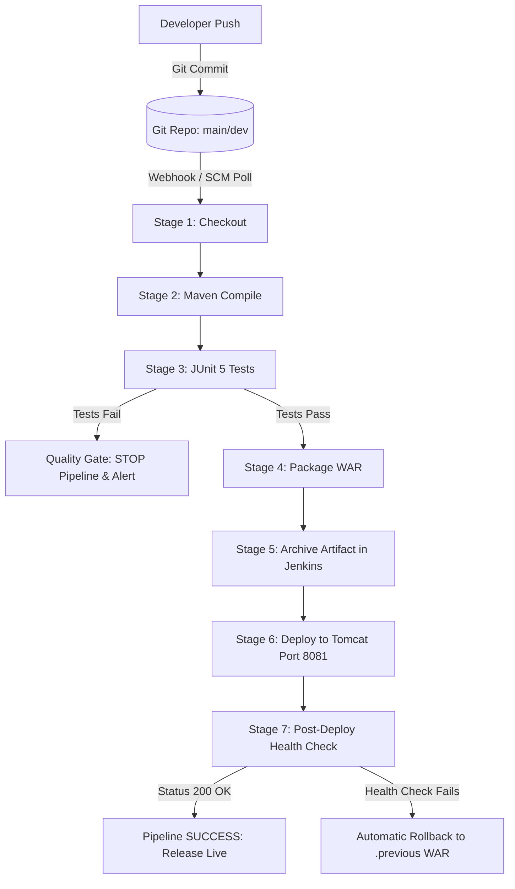

# DevOps Internship Project: End-to-End CI/CD Pipeline for Java Web Application

[](https://openjdk.org/)
[](https://maven.apache.org/)
[](https://www.jenkins.io/)
[-F8DC75?style=flat&logo=apachetomcat&logoColor=black)](https://tomcat.apache.org/)
[](https://junit.org/)
[](LICENSE)

An end-to-end Continuous Integration and Continuous Deployment (CI/CD) delivery pipeline for a Java Web Application (**Student Feedback Portal**) using Git, Maven, Jenkins, and Apache Tomcat with automated testing, artifact archiving, post-deployment health verification, and failure rollback recovery.

---

## 1. Project Overview & Syllabus Alignment

| Syllabus Area | How It Is Implemented in This Project |
| :--- | :--- |
| **SDLC & DevOps** | Automated full lifecycle: Plan &rarr; Code &rarr; Build &rarr; Test &rarr; Release &rarr; Deploy &rarr; Monitor. |
| **Linux OS & Commands** | Systemd service management (`systemctl status tomcat`), process checks, port configuration (`8081`), log inspection. |
| **Maven** | Clean compilation, JUnit 5 unit test execution, and WAR packaging (`student-feedback-portal.war`). |
| **Git** | 3-tier branching model (`main`, `dev`, `feature/*`) with conventional commit conventions. |
| **Tomcat** | Dedicated application server hosting on port `8081` with auto-deployment from `webapps/`. |
| **Jenkins** | 7-stage declarative pipeline with fail-fast quality gates, artifact archiving, and automated rollback. |

---

## 2. CI/CD Pipeline Architecture



---

## 3. Project Structure

```text
iStudio-Project/
├── pom.xml                             # Maven build definition & dependencies
├── Jenkinsfile                         # 7-stage Jenkins declarative pipeline
├── docker-compose.yml                  # Local test lab (Jenkins 8080 + Tomcat 8081)
├── data/
│   └── sample-feedback.csv             # 25+ preloaded student feedback records
├── src/
│   ├── main/
│   │   ├── java/com/devops/feedback/
│   │   │   ├── model/Feedback.java     # Feedback data model with validation
│   │   │   ├── service/FeedbackService.java # Thread-safe storage & analytics
│   │   │   ├── servlet/
│   │   │   │   ├── FeedbackServlet.java    # Form processing & validation
│   │   │   │   ├── HealthCheckServlet.java # /health JSON endpoint
│   │   │   │   └── DataViewerServlet.java  # Dataset view & CSV/JSON export
│   │   │   └── util/CsvUtil.java       # CSV parser & writer
│   │   ├── resources/
│   │   │   ├── app.properties          # Metadata
│   │   │   └── sample-feedback.csv     # Bundled classpath fallback
│   │   └── webapp/
│   │       ├── WEB-INF/web.xml         # Servlet 6.0 deployment descriptor
│   │       ├── css/style.css           # Modern responsive design system
│   │       ├── js/app.js               # Client validation & live health check
│   │       ├── index.jsp               # Landing page with feedback form
│   │       ├── feedback-list.jsp       # Feedback dashboard & analytics
│   │       └── success.jsp             # Confirmation page
│   └── test/
│       └── java/com/devops/feedback/
│           ├── FeedbackServiceTest.java # Unit tests for service logic
│           ├── CsvUtilTest.java         # Unit tests for CSV parser
│           └── HealthCheckServletTest.java # Unit tests for /health endpoint
├── scripts/
│   ├── deploy-to-tomcat.sh             # Linux deployment & verify script
│   ├── deploy-to-tomcat.ps1            # Windows deployment script
│   ├── health-check.sh                 # cURL health verification script
│   └── rollback.sh                     # Automated WAR rollback recovery script
├── docs/
│   ├── architecture.md                 # System architecture & SDLC stages
│   ├── setup-guide.md                  # Ubuntu Linux VM setup guide
│   ├── rollback-runbook.md             # Runbooks for 3 failure scenarios
│   └── screenshots/
│       └── README.md                   # Evidence catalogue guide
└── README.md
```

---

## 4. Quickstart & Local Execution

### Prerequisites:
- Java JDK 17 or 21
- Apache Maven 3.9+
- Git 2.x+
- *(Optional)* Docker & Docker Desktop

### 1. Compile and Run Unit Tests
```bash
mvn clean test
```
*Output: 13 tests run, 0 failures, 0 errors.*

### 2. Package the Web Application
```bash
mvn package -DskipTests
```
*Generated Artifact:* `target/student-feedback-portal.war`

### 3. Run Locally with Docker Sandbox (Optional)
```bash
docker compose up -d
```
- **Application Portal**: `http://localhost:8081/student-feedback-portal/`
- **Feedback Dashboard**: `http://localhost:8081/student-feedback-portal/feedback-list`
- **Health Check API**: `http://localhost:8081/student-feedback-portal/health`
- **Jenkins Controller**: `http://localhost:8080/`

---

## 5. Verification & Health Check Output

Query the application health endpoint:
```bash
curl -i http://localhost:8081/student-feedback-portal/health
```

### Response (HTTP 200 OK):
```json
{
  "status": "UP",
  "application": "Student Feedback Portal",
  "version": "1.0.0",
  "environment": "production",
  "statusCode": 200,
  "uptimeSeconds": 142,
  "totalFeedbackRecords": 25,
  "averageRating": 4.76,
  "jvmMemory": {
    "freeMemoryMb": 184,
    "totalMemoryMb": 512,
    "maxMemoryMb": 2048
  },
  "timestamp": "2026-08-18T08:35:00Z"
}
```

---

## 6. Failure Recovery & Rollback Procedures

The project demonstrates 3 failure handling paths (see [docs/rollback-runbook.md](docs/rollback-runbook.md)):

1. **Case A (Quality Gate - Broken Unit Test)**:
   - Introducing a failing test causes Stage 3 (`mvn test`) to fail immediately, preventing packaging and deployment.
2. **Case B (Faulty Deployment - Health Check Failure)**:
   - If `/health` fails after deployment, the Jenkins pipeline `post { failure }` automatically restores the previous working `.war` artifact.
3. **Case C (Git Rollback)**:
   - Using `git revert <commit-id>` creates a clean revert commit that triggers Jenkins to rebuild and redeploy the last stable release.

---

## 7. Deliverables Checklist

- [x] **Git Repository**: Initialized with branching model (`main`, `dev`, `feature/*`) and conventional commits.
- [x] **Working Java Maven Application**: Model, service, servlets, and responsive JSP frontend.
- [x] **Jenkins Declarative Pipeline**: 7-stage `Jenkinsfile` with quality gates and artifact archiving.
- [x] **Unit Test Suite**: 19 automated tests covering models, services, CSV parsing, and servlets.
- [x] **Sample Dataset**: `data/sample-feedback.csv` containing 25 realistic records.
- [x] **Automated Deployment & Rollback Scripts**: `deploy-to-tomcat.sh`, `health-check.sh`, `rollback.sh`.
- [x] **Complete Technical Documentation**:
  - [docs/architecture.md](docs/architecture.md)
  - [docs/setup-guide.md](docs/setup-guide.md)
  - [docs/rollback-runbook.md](docs/rollback-runbook.md)
