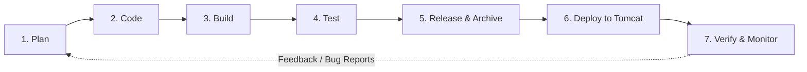

# Architecture & DevOps CI/CD Workflow

This document details the Software Development Life Cycle (SDLC) stages, system architecture, Jenkins pipeline stages, quality gates, and network topology for the **Student Feedback Portal** application.

---

## 1. SDLC & DevOps Lifecycle Flow

The project follows a standard 7-stage DevOps delivery lifecycle:



1. **Plan**: Define functional requirements (Feedback form, dataset ingestion, health metrics, and rollback procedures).
2. **Code**: Developer develops features on Git feature branches (`feature/<name>`) and creates pull requests into `dev` and `main`.
3. **Build**: Maven automates source compilation (`mvn clean compile`) using standard dependency management.
4. **Test**: Maven Surefire executes JUnit 5 test suites (`mvn test`) as an automated quality gate.
5. **Release & Archive**: Maven packages the application into `target/student-feedback-portal.war` and Jenkins archives the artifact with fingerprinting.
6. **Deploy**: The WAR artifact is automatically deployed to Apache Tomcat's `webapps` directory on port `8081`.
7. **Verify & Monitor**: Automated cURL script validates the `/health` endpoint for HTTP 200 OK and JSON status `UP`.

---

## 2. High-Level CI/CD Architecture

```
+------------------+         Git Push          +----------------------+
|    Developer     | ------------------------> |    Git Repository    |
| (Local / IDE)    |                           | (main / dev / feat)  |
+------------------+                           +----------------------+
                                                          |
                                                    Webhook / Poll
                                                          v
                                               +----------------------+
                                               |   Jenkins Pipeline   |
                                               +----------------------+
                                                          |
                 +----------------------------------------+----------------------------------------+
                 |                                                                                 |
                 v                                                                                 v
    [Stage 1: Git Checkout]                                                               [Stage 5: Archive WAR]
                 |                                                                                 |
                 v                                                                                 v
    [Stage 2: Maven Compile]                                                              [Stage 6: Deploy to Tomcat]
                 |                                                                                 |
                 v                                                                                 v
    [Stage 3: JUnit Test] --------(Fail Fast Gate)-------> [STOP Pipeline & Alert]        [Stage 7: Health Check]
                 |                                                                                 |
                 v                                                                                 v
    [Stage 4: Package WAR]                                                                [HTTP 200 / UP Verified]
                                                                                                   |
                                                                                                   v
                                                                                       +----------------------+
                                                                                       |  Apache Tomcat 10.1  |
                                                                                       |    (Port: 8081)      |
                                                                                       |  /student-feedback-  |
                                                                                       |        portal/       |
                                                                                       +----------------------+
```

---

## 3. Quality Gates & Failure Handling Rules

| Quality Gate | Trigger Condition | Pipeline Action | Rollback Action |
| :--- | :--- | :--- | :--- |
| **Unit Test Gate** | Any unit test in `src/test/java` fails | Pipeline **fails immediately** in Stage 3; skips package & deploy. | No server changes made; working server state preserved. |
| **Packaging Gate** | `target/*.war` file missing after build | Pipeline aborts in Stage 4. | Deploy step skipped. |
| **Health Check Gate** | `/health` fails or returns non-200 status after retries | Pipeline marks build as **FAILURE** in Stage 7. | `post { failure }` automatically restores `.previous` WAR backup to Tomcat. |

---

## 4. Network & Port Allocation

To avoid default port collision on Linux/cloud servers where both Jenkins and Tomcat default to port `8080`:

| Service | Protocol | Configured Port | Purpose |
| :--- | :--- | :--- | :--- |
| **Jenkins Controller** | HTTP | `8080` | CI/CD Web Dashboard, Webhooks, Build executor |
| **Apache Tomcat Server** | HTTP | `8081` | Web application hosting (`student-feedback-portal.war`) |
| **Tomcat Shutdown Port** | TCP | `8005` | Internal administrative shutdown signal |
| **Tomcat AJP Port** | AJP/1.3 | `8009` | Optional reverse proxy connector (Apache / NGINX) |
