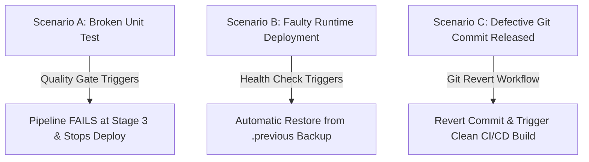

# Failure Simulation & Rollback Runbook

This runbook demonstrates how the CI/CD pipeline handles failures and executes recovery procedures across three realistic DevOps failure scenarios.

---

## Overview of Failure Scenarios



---

## Scenario A: Quality Gate Enforcement (Broken Unit Test)

### 1. Goal
Demonstrate that when a developer introduces a code regression that breaks unit tests, the Jenkins pipeline **immediately fails fast** at Stage 3, preventing faulty code from being packaged or deployed to Tomcat.

### 2. Failure Simulation Steps
Introduce a failing assertion in `src/test/java/com/devops/feedback/FeedbackServiceTest.java`:

```java
@Test
@DisplayName("[SIMULATION] Intentionally failing test")
public void testSimulationFailure() {
    // Intentionally assert false to trigger quality gate stop
    assertEquals("expected-pass", "actual-failure", "Quality gate test simulation");
}
```

Commit and push the broken test to Git:
```bash
git add src/test/java/com/devops/feedback/FeedbackServiceTest.java
git commit -m "test: simulate failing unit test for quality gate verification"
git push origin dev
```

### 3. Pipeline Execution Behavior
1. **Stage 1 (Checkout)**: Passed.
2. **Stage 2 (Maven Compile)**: Passed.
3. **Stage 3 (Unit Test)**: **FAILED** ❌
   ```text
   [INFO] Running com.devops.feedback.FeedbackServiceTest
   [ERROR] Failures: 1, Errors: 0, Skipped: 0
   [ERROR] testSimulationFailure - Quality gate test simulation ==> expected: <expected-pass> but was: <actual-failure>
   [INFO] BUILD FAILURE
   >>> QUALITY GATE FAILED: Unit tests did not pass! Pipeline execution halted prior to deploy.
   ```
4. **Stage 4 (Package)**: SKIPPED ⏭️
5. **Stage 5 (Archive)**: SKIPPED ⏭️
6. **Stage 6 (Deploy)**: SKIPPED ⏭️
7. **Stage 7 (Verify)**: SKIPPED ⏭️

### 4. Recovery / Remediation
Remove the failing assertion, re-run tests locally to confirm green status (`mvn test`), and push the fix:
```bash
git revert HEAD --no-edit
git push origin dev
```
*Result*: Next Jenkins build succeeds (Blue/Green build status).

---

## Scenario B: Post-Deployment Health Check Failure & Automatic Artifact Rollback

### 1. Goal
Demonstrate that if a deployment succeeds in copying a WAR but the application fails runtime startup or the `/health` endpoint returns an error, the pipeline marks the build as failed and **automatically rolls back** to the previously archived working WAR artifact.

### 2. Failure Simulation Steps
Simulate an application crash on startup (e.g. throwing a `RuntimeException` or returning HTTP 500 from `HealthCheckServlet.java`):

```java
@Override
protected void doGet(HttpServletRequest req, HttpServletResponse resp) throws IOException {
    // Simulation: server enters degraded mode
    resp.setStatus(HttpServletResponse.SC_INTERNAL_SERVER_ERROR);
    resp.getWriter().write("{\"status\": \"DOWN\", \"error\": \"Database connection timeout\"}");
}
```

Push change to trigger pipeline:
```bash
git commit -am "fix: simulate faulty runtime health endpoint"
git push origin dev
```

### 3. Pipeline Execution Behavior
1. Stages 1–6 complete.
2. **Stage 7 (Health Check)** polls `http://localhost:8081/student-feedback-portal/health`.
3. Health check receives `HTTP 500` instead of `HTTP 200`:
   ```text
   Attempt 1 of 6: Checking http://localhost:8081/student-feedback-portal/health...
   Warning: Received HTTP status 500. Waiting 5 seconds before retry...
   ...
   FATAL ERROR: Health check failed after 6 attempts!
   ```
4. **Pipeline Post-Action (Failure)** executes:
   ```bash
   Restoring previous known good WAR artifact from backup...
   cp /opt/tomcat/backups/student-feedback-portal.war.previous /opt/tomcat/webapps/student-feedback-portal.war
   Restored previous build to /opt/tomcat/webapps/student-feedback-portal.war
   ```

### 4. Manual Rollback Verification
If executing via CLI runbook:
```bash
# Execute standalone rollback script
./scripts/rollback.sh
```

---

## Scenario C: Git-Based Version Rollback

### 1. Goal
Demonstrate reverting a problematic release back to the previous stable commit using Git history, triggering a fresh, clean build in Jenkins.

### 2. Steps to Execute Git Rollback
1. View recent commit history to identify the last known good commit:
   ```bash
   git log --oneline -n 5
   ```
   *Example Output:*
   ```text
   a1b2c3d (HEAD -> main) feat: faulty feature change
   9e8f7a6 feat: stable student feedback portal release v1.0.0
   ```

2. Revert the bad commit:
   ```bash
   git revert a1b2c3d -m 1 --no-edit
   ```

3. Push the revert commit to trigger Jenkins:
   ```bash
   git push origin main
   ```

4. Jenkins automatically detects the new commit via Webhook/Polling, compiles the verified stable code, passes all tests, generates `student-feedback-portal.war`, and deploys it to Tomcat with a verified HTTP 200 health check.
